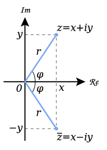
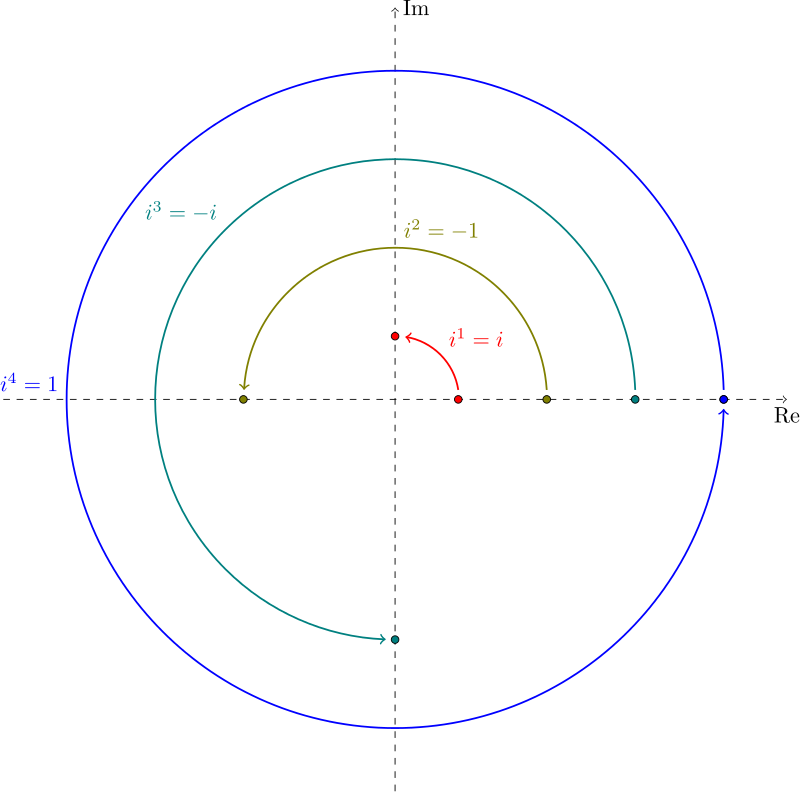

This article is copied from wikipedia for educational purposes, [see the original article](https://en.wikipedia.org/wiki/Imaginary_number)

An **imaginary number** is a complex number that can be written as a real number multiplied by the imaginary unit $i$, which is defined by its property $i^2 = −1$. The square of an imaginary number $bi$ is $−b^2$. For example, $5i$ is an imaginary number, and its square is $−25$. By definition, zero is considered to be both real and imaginary. The set of imaginary numbers is sometimes denoted using the blackboard bold letter $\mathbb{I}$.

Originally coined in the 17th century by René Descartes as a derogatory term and regarded as fictitious or useless, the concept gained wide acceptance following the work of Leonhard Euler (in the 18th century) and Augustin-Louis Cauchy and Carl Friedrich Gauss (in the early 19th century).

An imaginary number $bi$ can be added to a real number $a$ to form a complex number of the form $a + bi$, where the real numbers $a$ and $b$ are called, respectively, the real part and the imaginary part of the complex number.

#### History

Although Greek mathematician and engineer Hero of Alexandria is noted as the first to have conceived these numbers, Rafael Bombelli first set down the rules for multiplication of complex numbers in 1572. The concept had appeared in print earlier, for instance in work by Gerolamo Cardano. At the time, imaginary numbers (as well as negative numbers) were poorly understood, and regarded by some as fictitious or useless much as zero once was. Many other mathematicians were slow to adopt the use of imaginary numbers, including René Descartes, who wrote about them in his La Géométrie, where the term imaginary was used and meant to be derogatory. The use of imaginary numbers was not widely accepted until the work of Leonhard Euler (1707–1783) and Carl Friedrich Gauss (1777–1855). The geometric significance of complex numbers as points in a plane was first described by Caspar Wessel (1745–1818).

In 1843, William Rowan Hamilton extended the idea of an axis of imaginary numbers in the plane to a four-dimensional space of quaternion imaginaries, in which three of the dimensions are analogous to the imaginary numbers in the complex field.

With the development of quotient rings of polynomial rings, the concept behind an imaginary number became more substantial, but then one also finds other imaginary numbers, such as the $j$ of tessarines, which has a square of $+1$. This idea first surfaced with the articles by James Cockle beginning in 1848.

#### Geometric interpretation

Geometrically, imaginary numbers are found on the vertical axis of the complex number plane, allowing them to be presented perpendicular to the real axis. One way of viewing imaginary numbers is to consider a standard number line, positively increasing in magnitude to the right, and negatively increasing in magnitude to the left. At $0$ on this $x$-axis, a $y$-axis can be drawn with "positive" direction going up; "positive" imaginary numbers then increase in magnitude upwards, and "negative" imaginary numbers increase in magnitude downwards. This vertical axis is often called the "imaginary axis" and is denoted $i\mathbb{R}$, $\mathbb{I}$, or $ℑ$.

In this representation, multiplication by $–1$ corresponds to a rotation of $180$ degrees about the origin. Multiplication by $i$ corresponds to a 90-degree rotation in the "positive", counterclockwise direction, and the equation $i^2 = −1$ is interpreted as saying that if we apply two 90-degree rotations about the origin, the net result is a single 180-degree rotation. Note that a 90-degree rotation in the "negative" direction (i.e. clockwise) also satisfies this interpretation. This reflects the fact that $−i$ also solves the equation $x^2 = −1$. In general, multiplying by a complex number is the same as rotating around the origin by the complex number's argument, followed by a scaling by its magnitude.

#### Square roots of negative numbers

Care must be used when working with imaginary numbers, that are expressed as the principal values of the square roots of negative numbers. For example:

$$6=\sqrt{36}=\sqrt{(-4)(-9)} = \sqrt{-4}\sqrt{-9} = (2i)(3i) = 6 i^2 = -6.$$

Sometimes this is written as:

$$-1 = i^2 = \sqrt{-1}\sqrt{-1} = \sqrt{(-1)(-1)} = \sqrt{1} = 1.$$

The Mathematical fallacy occurs as the equality $\sqrt{xy} = \sqrt{x}\sqrt{y}$ fails when the variables are not suitably constrained. In this case, the equality fails to hold as the numbers are both negative. This can be demonstrated by,

$$\sqrt{-x}\sqrt{-y} = i \sqrt{x} \ i \sqrt{y} = i^2 \sqrt{x} \sqrt{y} = -\sqrt{xy} = \sqrt{xy},$$

where both $x$ and $y$ are non-negative real numbers.
